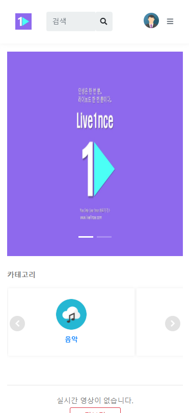
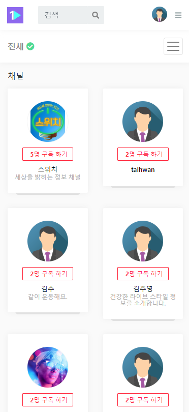

## 프로젝트 개요

해당 프로젝트는 tv조선 라이브원스 미디어를 위해 제작된 사이트입니다
 
디자인상의 수정들과, 데이터베이스 설계, 영상송출 테스트 등에 참여했습니다
 
 

## 작업 포인트

영상의 원활한 송출이 주요 문제였고 그 외에는 작은 기능이라도 정확히 하는데에 집중했습니다
 
 

## 개발 기술

Java·Spring
 
Handlebars·HTML5/CSS3·Bootstrap4
 
Javascript·Ajax·JQuery
 
MySQL·Mybatis
  
websocket/js
  
  
  
  
https://www.live1nce.com
  
  
  
  

  

  

  

  

  

